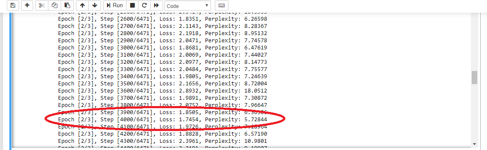

# Automatic-Image-Captioning
A neural network architecture(CNN+LSTM) that automatically generates captions from the images. The model uses ResNet architecture to train the Encoder while DecoderRNN has to be trained with our choice of trainable parameters. I have trained the model on the Microsoft Common Objects in COntext (MS COCO) dataset and have tested the network on fictitious images!

# Summary

* Dataset used is the COCO data set by Microsoft.
* Feature vectors for images are generated using a CNN based on the ResNet architecture by Google.
* Word embeddings are generated from captions for training images. NLTK was used for working with processing of captions.
* Implemented an RNN decoder using LSTM cells.
* Trained the network for more than 6 hrs for 3 epochs using GPU to achieve average loss of about 2%.

  
  
* Obtained outputs for some test images to understand efficiency of the trained network.

